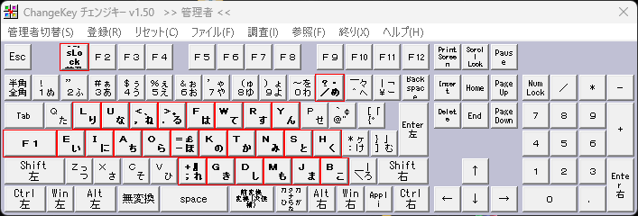

# key-map-kanata

個人的に使っているキーボードの論理配列設定です。

単純に記録と保存を目的としています。

参考になるように、移行自体も書きます。

## 前提

私が使っているのは大西配列です。

メインPCはWindows、実習時にLinux、たまにMacbookを借りることがあります。

メインPCは完全に大西配列に整えています。
https://o24.works/layout/

Change Keyというソフトを使い、常駐アプリを使わずにレジスタに登録しているので、ログイン前にも大西配列が機能します。

https://forest.watch.impress.co.jp/library/software/changekey/

_バージョン対応は明記されていませんが、win11で問題なく動いています_

### 物理キー状態
Change Keyで以下のような変更をしています
```
W -> L
E -> U
R -> ,
T -> .
Y -> F
U -> W
I -> R
O -> Y
A -> E
S -> I
D -> A
F -> O
G -> =
H -> K
K -> T
L -> S
; -> H
B -> ;
N -> G
M -> D
, -> M
. -> J
- -> B

Caps -> F1
F1 -> Caps
```



さて、ここにRust製OSSのkanataを加えてキーボード機能を更に変更します

https://github.com/jtroo/kanata


## 導入手順